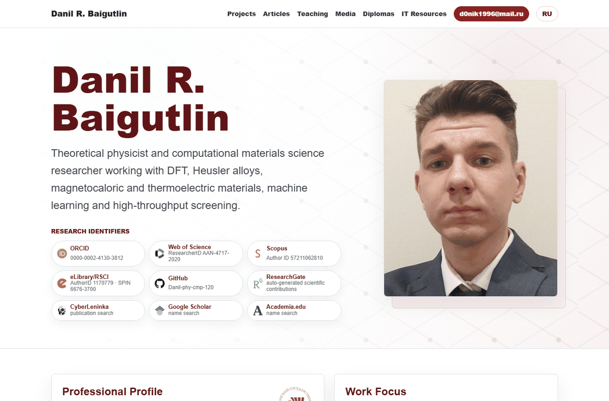
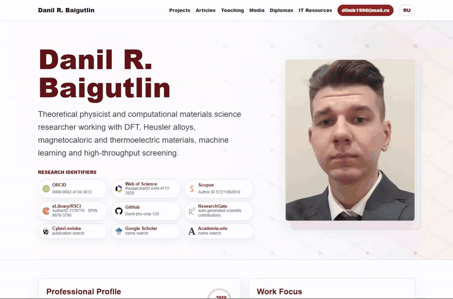
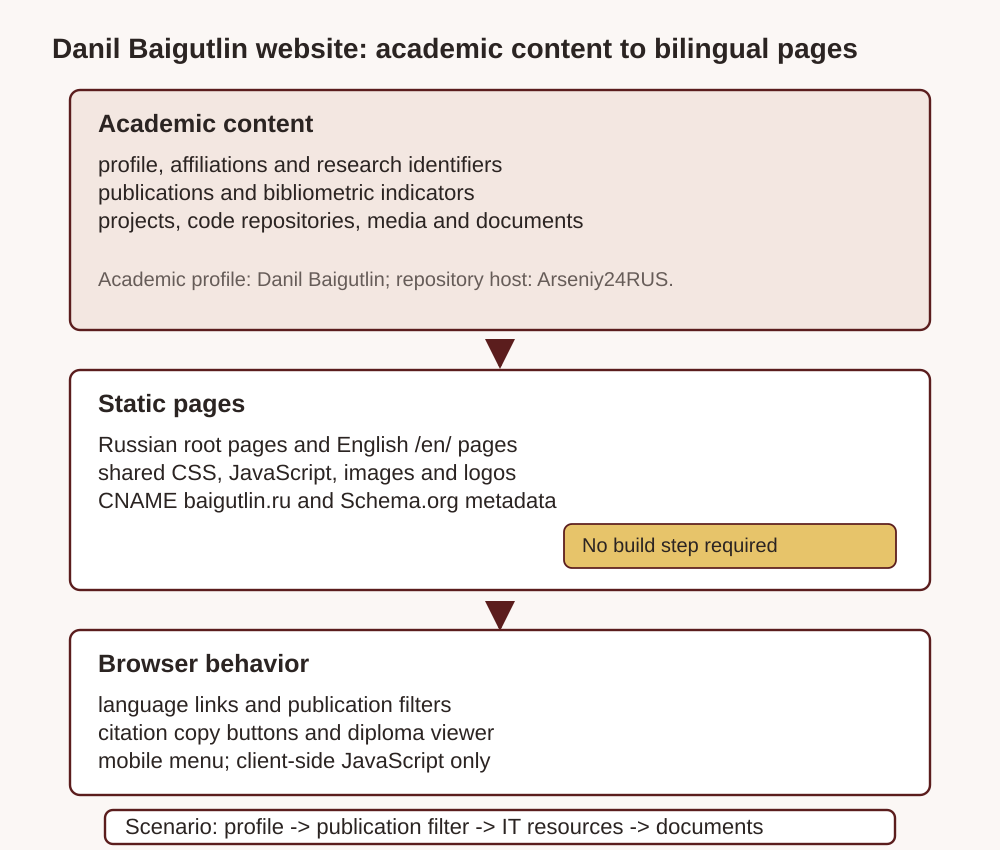
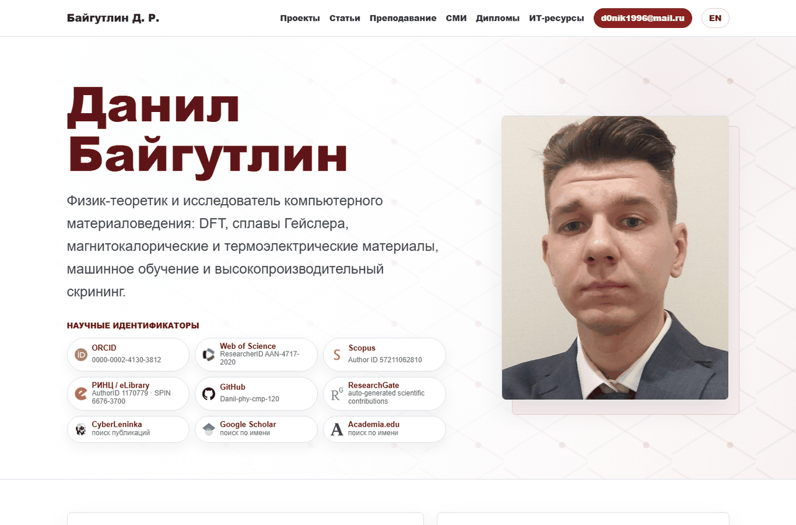
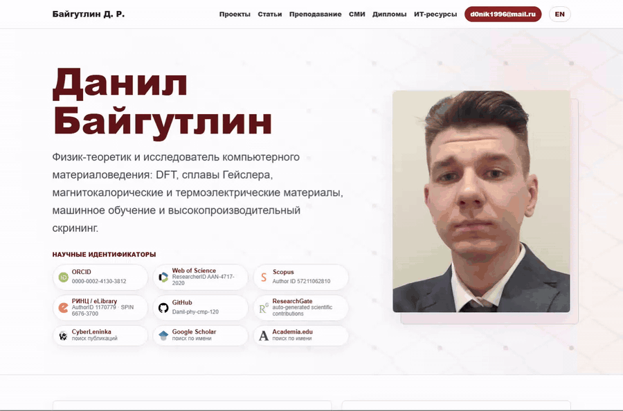
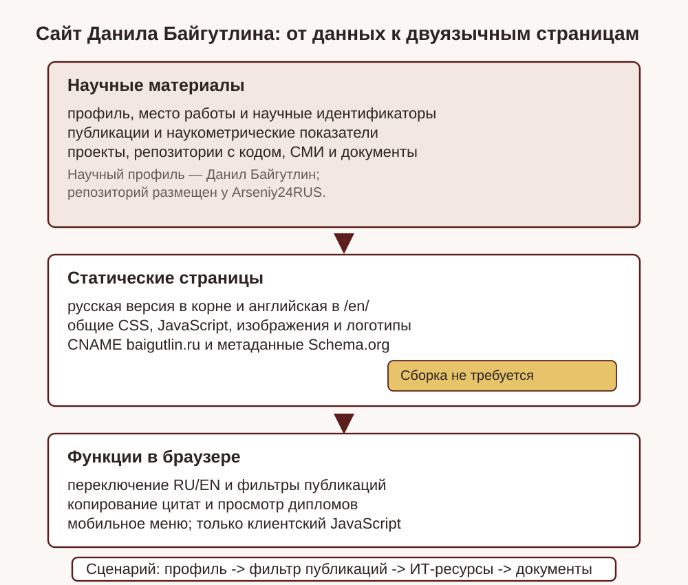

# Danil Baigutlin personal academic website

[English](#english) · [Русский](#русский)

Live site: <https://baigutlin.ru/>



*The screenshot shows the English homepage with Danil Baigutlin's public profile, research identifiers and portrait.*

## English



*The workflow filters publications, opens the computational resources page and previews a public diploma document.*

### What This Repository Contains

This repository is the static public website for Danil Rasulovich Baigutlin, a condensed-matter physicist and computational materials science researcher. The repository is hosted under `Arseniy24RUS`; the academic profile and site materials belong to Danil Baigutlin. The pages describe Danil's academic profile, publications, teaching, projects, media mentions, diplomas and software-related research resources. The canonical domain is set by [`CNAME`](CNAME) to `baigutlin.ru`, and the Russian homepage is [`index.html`](index.html) while the English homepage is [`en/index.html`](en/index.html).

The audience is mixed: scientific collaborators, students, conference organizers, employers, reviewers and people who need a reliable public identity page. A typical user lands on the homepage, checks research identifiers such as ORCID, Scopus, Web of Science, eLibrary/RSCI and GitHub, filters the publications list by year or topic, opens IT resources connected with DFT and materials modelling, and checks supporting documents or media mentions when needed.

### Real Capabilities

The site is a static bilingual portfolio. It has Russian pages at the repository root and English pages under [`en/`](en/). Shared styling lives in [`assets/css/site.css`](assets/css/site.css), and the only client-side behavior is implemented in [`assets/js/site.js`](assets/js/site.js): mobile navigation toggling, publication/media-style filters, citation-copy buttons and a diploma preview modal. There is no hidden backend, build service, analytics pipeline or automatic publication harvester in the shipped site.

The content model is file-based. [`data/public/profile.json`](data/public/profile.json) contains the bilingual profile, affiliation, degree, awards, research activity, expertise and skills. [`data/public/metrics.json`](data/public/metrics.json) records public bibliometric counts for Scopus, Web of Science and RSCI/eLibrary, including the eLibrary update date. [`data/public/publications.json`](data/public/publications.json) powers the publication pages with GOST and APA-style references, URLs and source tags. [`data/public/projects.json`](data/public/projects.json) describes research projects, while [`data/it/repositories.json`](data/it/repositories.json) lists public GitHub repositories such as thermoelectric Heusler datasets, VASP workflows, Monte Carlo code and optimization notebooks. Media and supporting documents are declared in [`data/media/published.json`](data/media/published.json) and [`data/diplomas/gallery.json`](data/diplomas/gallery.json).



### Methodology And Editorial Boundaries

The site uses public and manually curated profile data. It links out to external scholarly identifiers and source pages rather than republishing third-party profiles wholesale. Some links are search links, not claimed verified profiles: for example, Google Scholar, CyberLeninka and Academia.edu are presented as name searches in the page copy. Media entries carry fields such as `verified`, `confidence` and `discovery_sources`, which helps distinguish direct mentions from broader contextual pages.

Academic and bibliometric numbers can become stale because they live in JSON/HTML rather than being queried live. The README therefore describes the repository as a static snapshot, not as an automated live CV. The diploma gallery contains public thumbnails and source document links present in this repository; it should not be extended with private credentials or non-public documents without explicit approval.

### Run Locally And Check

No package install is required for the current site. Serve the repository root with any static server:

```bash
python -m http.server 8000
```

Then open `http://127.0.0.1:8000/` for Russian or `http://127.0.0.1:8000/en/` for English. Useful manual checks are: homepage loads, RU/EN links resolve, publication filters update the visible count, copy buttons change state, IT resource cards show external GitHub links, and the diploma modal opens and closes without exposing local files.

### Licensing And Attribution

No top-level `LICENSE` file is present, so the repository does not grant a broad open-source reuse license by default. The profile photograph, diploma scans, logos, media images and institution marks should be treated as site-specific assets unless a source file states otherwise. External scholarly profiles and media pages remain under their own providers' terms. The site itself includes Schema.org `Person`, `WebSite` and `ProfilePage` metadata in the HTML for discoverability, but those metadata do not alter licensing.

<details>
<summary>Repository map</summary>

- `index.html`, `projects.html`, `publications.html`, `teaching.html`, `media.html`, `diplomas.html`, `it.html`, `materials.html`, `metrics.html` and `admin.html` are the Russian pages.
- `en/*.html` contains the English equivalents.
- `assets/` contains CSS, JavaScript, images, logos, social icons and generated README visuals.
- `data/public/`, `data/media/`, `data/it/` and `data/diplomas/` contain structured source content used to build or audit the static pages.
- `content/diplomas/` contains linked supporting documents.

</details>

## Русский



*Скриншот показывает русскую главную страницу с публичным профилем, научными идентификаторами и портретом Данила Байгутлина.*



*Сценарий фильтрует публикации, открывает страницу вычислительных ресурсов и показывает публичный документ из раздела дипломов.*

### Что находится в репозитории

Этот репозиторий — статический публичный сайт Данила Расуловича Байгутлина, физика конденсированного состояния и исследователя вычислительного материаловедения. Репозиторий размещен в аккаунте `Arseniy24RUS`, а научный профиль и материалы сайта относятся к Данилу Расуловичу Байгутлину. Страницы описывают академический профиль Данила, публикации, преподавание, проекты, упоминания в СМИ, дипломы и исследовательские ИТ-ресурсы. Канонический домен задан в [`CNAME`](CNAME) как `baigutlin.ru`; русская главная страница — [`index.html`](index.html), английская — [`en/index.html`](en/index.html).

Аудитория сайта смешанная: научные соавторы, студенты, организаторы конференций, работодатели, рецензенты и люди, которым нужна надежная публичная страница исследователя. Типовой сценарий: пользователь открывает главную, проверяет ORCID, Scopus, Web of Science, eLibrary/РИНЦ и GitHub, фильтрует публикации по году или теме, смотрит ИТ-ресурсы по DFT и моделированию материалов, а затем при необходимости открывает подтверждающие документы или упоминания в СМИ.

### Реальные возможности

Сайт является статическим двуязычным портфолио. Русские страницы находятся в корне, английские — в [`en/`](en/). Общие стили лежат в [`assets/css/site.css`](assets/css/site.css), а вся клиентская логика — в [`assets/js/site.js`](assets/js/site.js). Этот скрипт отвечает только за видимые функции: мобильное меню, фильтры списков, кнопки копирования цитат и просмотр дипломов в модальном окне. В поставке нет скрытой серверной части, аналитики в реальном времени, сборочного сервиса или автоматического сбора публикаций.

Контент хранится в структурированных файлах. [`data/public/profile.json`](data/public/profile.json) содержит двуязычный профиль, место работы, ученую степень, награды, научную активность, экспертизу и навыки. [`data/public/metrics.json`](data/public/metrics.json) фиксирует публичные наукометрические показатели Scopus, Web of Science и РИНЦ/eLibrary, включая дату обновления eLibrary. [`data/public/publications.json`](data/public/publications.json) наполняет страницы публикаций ссылками по ГОСТ и APA, URL и метками источников. [`data/public/projects.json`](data/public/projects.json) описывает исследовательские проекты, а [`data/it/repositories.json`](data/it/repositories.json) перечисляет публичные GitHub-репозитории: наборы данных по сплавам Гейслера, сценарии расчетов VASP, код Монте-Карло, вычислительные блокноты для оптимизации и другие материалы по вычислительному материаловедению. СМИ и подтверждающие документы описаны в [`data/media/published.json`](data/media/published.json) и [`data/diplomas/gallery.json`](data/diplomas/gallery.json).



### Методология и редакционные границы

Сайт использует публичные и вручную курируемые данные профиля. Он ссылается на внешние научные идентификаторы и страницы источников, но не перепубликует сторонние профили целиком. Часть ссылок является поисковыми ссылками, а не заявленными верифицированными профилями: Google Scholar, CyberLeninka и Academia.edu в тексте страницы обозначены как поиск по имени. Записи СМИ содержат поля `verified`, `confidence` и `discovery_sources`, что помогает отличать прямое упоминание от более широкого контекстного материала.

Академические и наукометрические числа могут устаревать, потому что они записаны в JSON/HTML и не запрашиваются из внешних сервисов при каждом открытии страницы. Поэтому README описывает репозиторий как зафиксированное статическое состояние сайта, а не как автоматическую систему обновления научного резюме. Галерея дипломов содержит публичные миниатюры и ссылки на документы, уже присутствующие в репозитории; ее не следует расширять приватными удостоверениями или непубличными материалами без явного разрешения.

### Локальный запуск и проверки

Для текущего сайта не нужна установка пакетов. Достаточно запустить простой сервер статических файлов из корня:

```bash
python -m http.server 8000
```

Затем открыть `http://127.0.0.1:8000/` для русской версии или `http://127.0.0.1:8000/en/` для английской. Полезные ручные проверки: главная страница загружается, RU/EN-ссылки ведут на соответствующие версии, фильтры публикаций меняют счетчик видимых строк, кнопки копирования меняют состояние, карточки IT-ресурсов ведут на внешние GitHub-ссылки, а модальное окно диплома открывается и закрывается без обращения к локальным файлам.

### Лицензии и атрибуция

В корне нет файла `LICENSE`, поэтому репозиторий не выдает общей открытой лицензии на повторное использование. Фотографию профиля, сканы дипломов, логотипы, изображения из раздела СМИ, знаки организаций и другие материалы сайта следует считать ресурсами именно этого сайта, если отдельный источник не говорит обратное. Внешние научные профили и страницы СМИ остаются под условиями своих площадок. HTML содержит метаданные Schema.org `Person`, `WebSite` и `ProfilePage` для лучшей индексации, но эти метаданные не меняют лицензионные условия.

<details>
<summary>Карта репозитория</summary>

- `index.html`, `projects.html`, `publications.html`, `teaching.html`, `media.html`, `diplomas.html`, `it.html`, `materials.html`, `metrics.html` и `admin.html` — русские страницы.
- `en/*.html` — английские версии.
- `assets/` содержит CSS, JavaScript, изображения, логотипы, иконки соцсетей и иллюстрации для README.
- `data/public/`, `data/media/`, `data/it/` и `data/diplomas/` содержат структурированный контент для сборки или аудита статических страниц.
- `content/diplomas/` содержит связанные подтверждающие документы.

</details>
